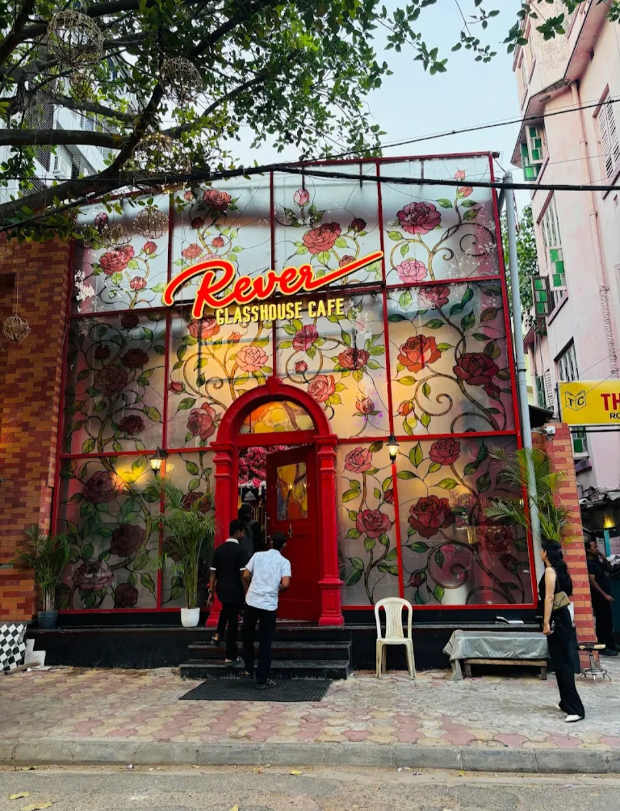
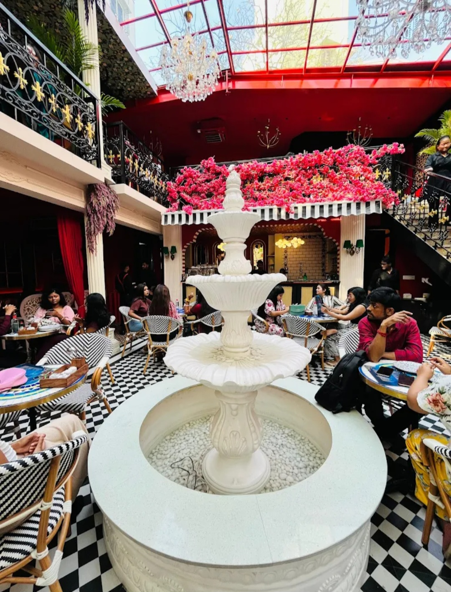
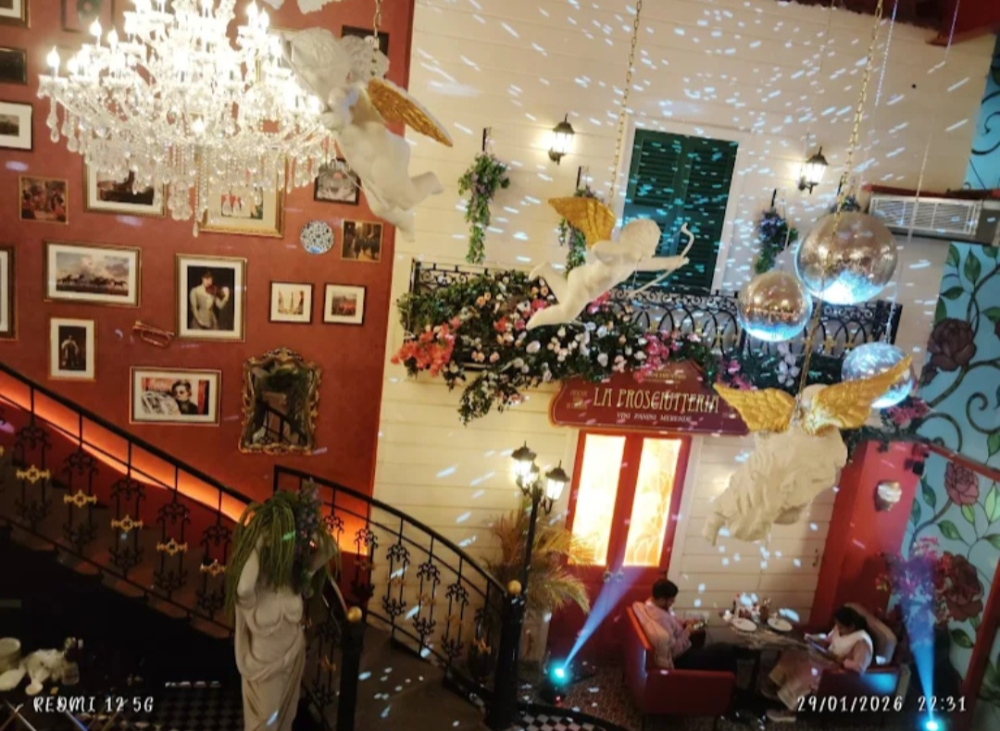
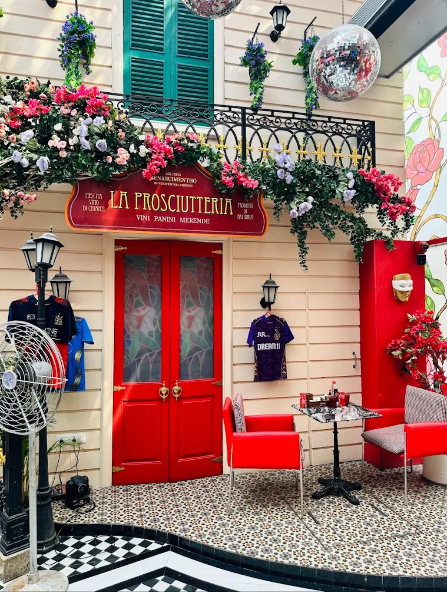
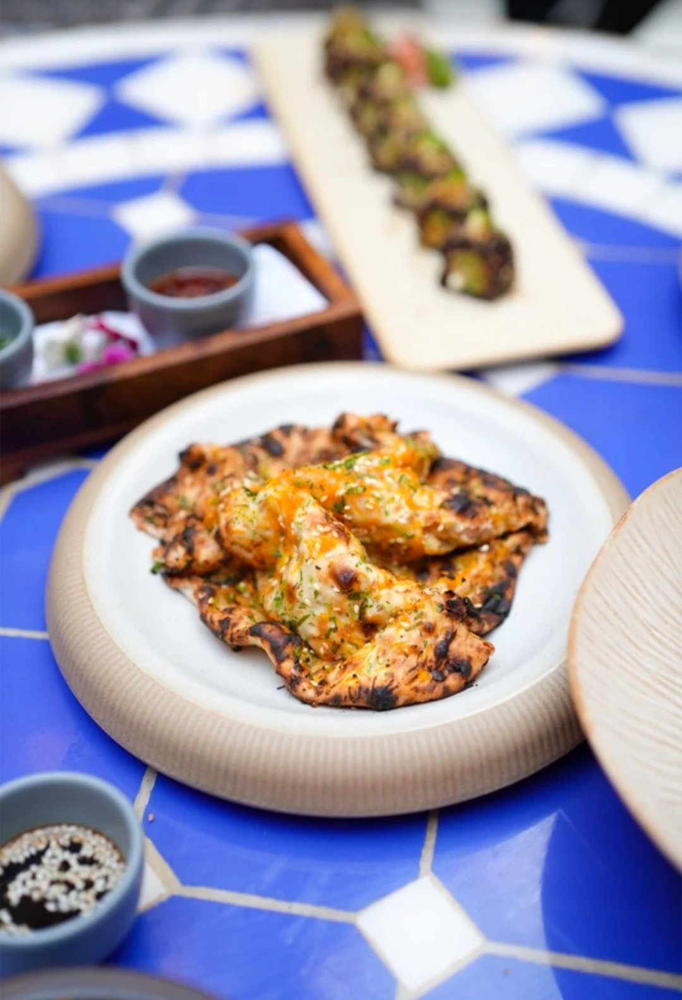
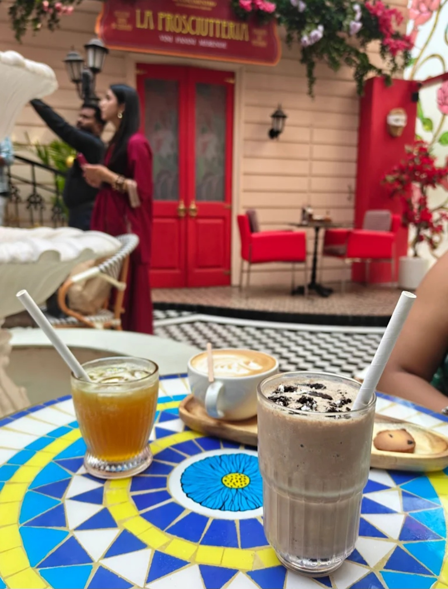
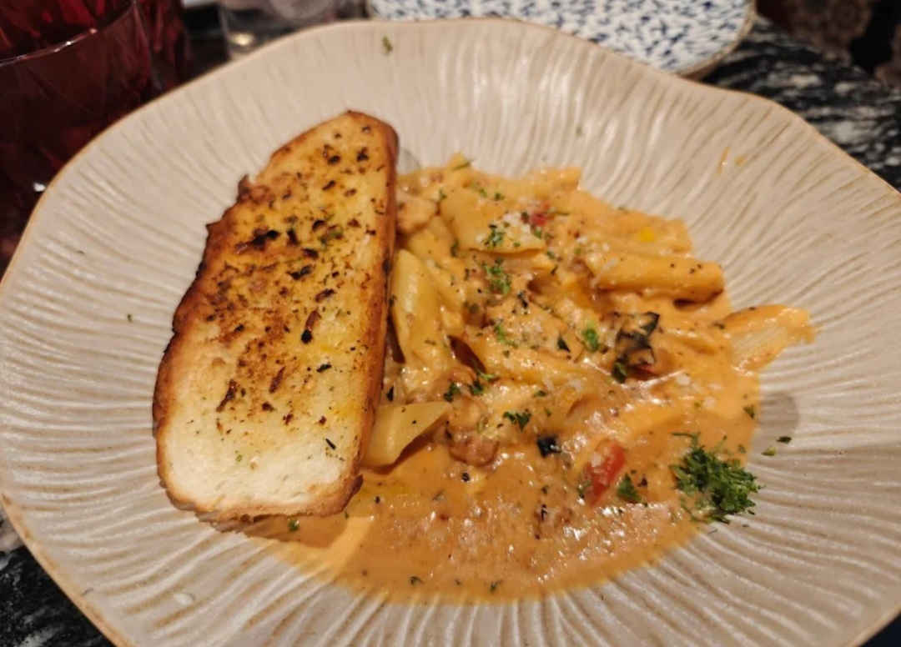
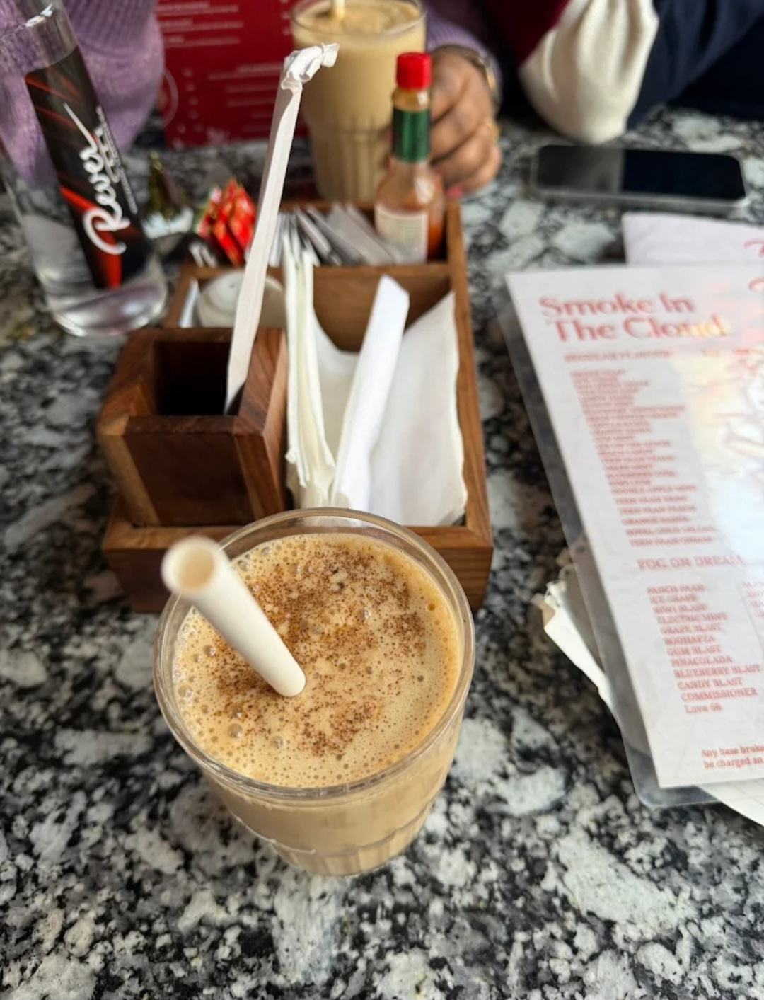
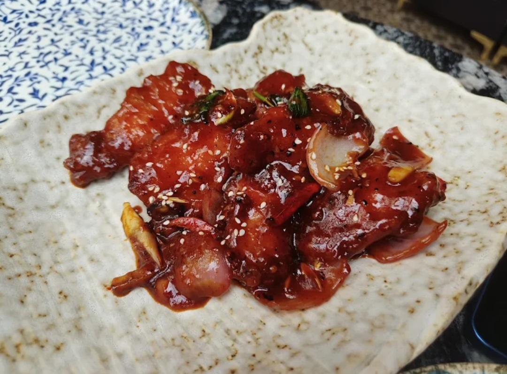

# Rever Cafe Kolkata - Premium Website

A modern, high-conversion website for Rever Cafe featuring modern heritage aesthetics with deep forest green, cream, and gold color scheme.

## Features

✅ **Multi-Page Website**
- Home (Hero + Quick Info)
- Menu (3 Categories: Brew, Bake, Bites)
- About (Story & Values)
- Gallery (Interiors + Food + Reviews)
- Contact (Map + Booking)

✅ **Interactive Elements**
- Floating WhatsApp button
- Table booking modal with WhatsApp integration
- Interactive menu categories with hover effects
- Google Maps integration
- Mobile-responsive design
- Smooth page transitions

✅ **Performance Optimized**
- Tailwind CSS for minimal CSS
- No external dependencies (except Tailwind CDN)
- Optimized for 100/100 PageSpeed score
- Mobile-first design
- Semantic HTML

✅ **SEO Optimized**
- Meta tags for location-specific search
- Open Graph tags for social sharing
- Structured business information
- Mobile-friendly design
- Fast page load times

## Color Palette

- **Forest Green**: #1b3022
- **Cream**: #f4f1de
- **Gold**: #d4af37

## Files Included

- `index.html` - Main website file (all pages + styles included)

## Customization Guide

### Adding Your Images

Replace the placeholder images in the HTML with your actual photos:

```html
<!-- For Interiors -->





<!-- For Food -->





```

### Adding Your Menu PDF

Replace the link with your actual menu PDF:

```html
<a href="revercafe.menu.pdf" target="_blank" class="btn-primary text-lg inline-block">
    📥 Download Full Menu (PDF)
</a>
```

### Customizing Contact Information

Replace the following with your actual details:

- **Phone**: Update `099033 15530` (already included)
- **WhatsApp**: Update `919903315530` in WhatsApp links
- **Instagram**: Already linked to `https://www.instagram.com/revercafekolkata`
- **Google Maps Review**: Already linked to your review link
- **Location**: Update the Google Maps embed code

### Modifying Business Hours

Find and update the hours in multiple sections:

```html
<p class="text-sm text-gray-600">Mon-Fri: 8 AM - 10 PM</p>
<p class="text-sm text-gray-600">Sat-Sun: 9 AM - 11 PM</p>
```

### Updating Menu Items

Edit the menu items in the menu section with your actual items and prices.

## Deployment

### GitHub Pages

1. Create a new repository named `revercafekolkata` or similar
2. Upload `index.html` to the repository
3. Enable GitHub Pages in Settings > Pages
4. Your site will be live at `https://yourusername.github.io/revercafekolkata`

### Other Hosting

- Upload `index.html` to your web host
- Ensure images are in the same directory or update image paths
- Ensure the `revercafe.menu.pdf` is in the same directory

## Performance Optimization Tips

1. **Optimize Images**
   - Use WebP format where possible
   - Compress JPG/PNG files
   - Use appropriate dimensions (not oversized)

2. **Lazy Loading**
   - Images load on scroll for better performance

3. **Caching**
   - Enable browser caching on your server
   - Set appropriate cache headers

4. **CDN**
   - Consider using a CDN for images
   - Tailwind CSS is loaded from CDN (fast)

## SEO Optimization

The website includes:

- ✅ Meta title and description
- ✅ Location-based keywords (Kolkata)
- ✅ Open Graph tags for social sharing
- ✅ Mobile-friendly viewport settings
- ✅ Author and canonical URL tags
- ✅ Semantic HTML structure

### Local SEO

To improve local search results:

1. **Ensure Google Business Profile is complete**
   - Add all business hours
   - Upload high-quality photos
   - Respond to reviews
   - Add service areas

2. **Build Local Citations**
   - Consistent NAP (Name, Address, Phone)
   - Listed in local directories

3. **Get Reviews**
   - Encourage customers to leave reviews
   - Respond to all reviews
   - Link to: https://maps.app.goo.gl/GhFE3Nk4djbS52WG6

## Mobile Responsiveness

The website is fully responsive across:
- Mobile devices (320px+)
- Tablets (768px+)
- Desktops (1024px+)

## Browser Compatibility

Works on:
- Chrome/Chromium
- Firefox
- Safari
- Edge
- Mobile browsers

## Features Breakdown

### Hero Section
- Eye-catching headline
- Dual CTA buttons (Book a Table + View Menu)
- Hero overlay pattern for elegance

### Menu Page
- Interactive category tabs (Brew, Bake, Bites)
- Item descriptions with prices
- Dietary badges (Vegan, Gluten-Free, etc.)
- Download full menu PDF button

### About Page
- Brand story
- Core values with icons
- CTA for bookings

### Gallery Page
- Interior showcase (4 images)
- Food photography (5 images)
- Customer reviews (4+ reviews)
- Google Maps review link

### Contact Page
- Location, phone, hours cards
- Complete booking form
- Embedded Google Maps
- Social media links

## Floating WhatsApp Button

Always visible on mobile and desktop. Links directly to:
- WhatsApp: +919903315530
- Pre-filled message prompts ordering/booking

## Interactive Elements

- Smooth scroll behavior
- Page transitions with fade-in effect
- Hover effects on buttons and cards
- Mobile menu toggle
- Form validation
- Modal bookings

## Analytics Integration

To add Google Analytics, add this to the `<head>` section:

```html
<!-- Google Analytics -->
<script async src="https://www.googletagmanager.com/gtag/js?id=YOUR_GA_ID"></script>
<script>
  window.dataLayer = window.dataLayer || [];
  function gtag(){dataLayer.push(arguments);}
  gtag('js', new Date());
  gtag('config', 'YOUR_GA_ID');
</script>
```

## Support & Customization

For any customization needs or to add features:
- Ensure all custom images are optimized
- Test on mobile devices before deployment
- Validate HTML using W3C validator
- Test WhatsApp links on actual mobile devices

## Future Enhancements

Consider adding:
- Online ordering system
- Loyalty program
- Blog/news section
- Event calendar
- Customer login
- Email newsletter signup

## License

This website is custom-built for Rever Cafe Kolkata. All rights reserved.

---

**Last Updated**: May 2024
**Website**: Rever Cafe Kolkata
**Location**: AJC Bose Road, Kolkata
**Contact**: +91 99033 15530
